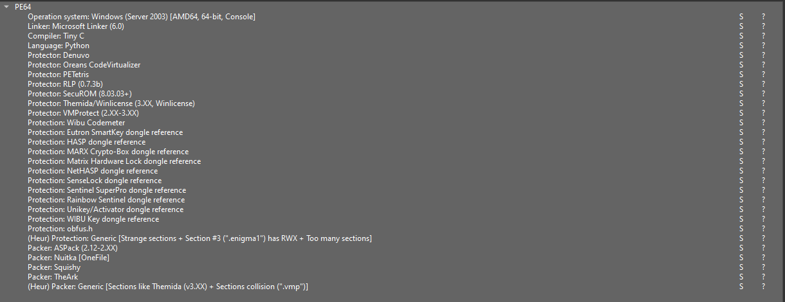
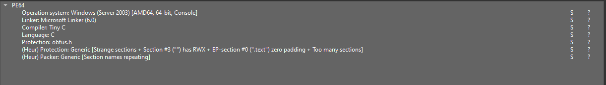

<div align="center">
  <h1>🛡️ ObfusFake Signatures Remover</h1>
  <p><b>Advanced PE Signature Neutralizer for Obfus.h</b></p>
  <br/>
</div>

## 📌 Overview

**ObfusFake Signatures Remover** is a lightning-fast, C-based utility designed specifically to strip fake protection signatures and sections injected by the `Obfus.h` library. 

Obfuscators like `Obfus.h` often attempt to trick analysts and automated scanners (such as Detect It Easy) by adding dozens of fake protections (e.g., VMProtect, Enigma, Denuvo, UPX) to a single Windows Portable Executable (PE) file. This unpacker parses the PE file and safely neutralizes these fake elements, restoring clarity to your static analysis without breaking the executable.

Whether you're dealing with a heavily spoofed binary or just want to see the real compiler signatures underneath the noise, this tool ensures you get the true picture.

---

## 🚀 Features

- **Safe PE Neutralization**: Safely disarms fake signatures without physically removing or shifting sections, ensuring the PE structure remains 100% intact and the file stays executable by the Windows Loader.
- **Section De-Spoofing**: Automatically identifies fake section names (e.g., `.vmp0`, `.enigma1`, `UPX0`) and renames them to `.data` or neutralizes them entirely.
- **Deep Signature Wiping**: Zeroes out fake byte patterns and string signatures hidden deep in the binary (Denuvo, Nuitka, Screen2Exe, etc.).
- **Smart Optimization**: Calculates the minimum required physical size based on legitimate PE headers and safely truncates trailing unused zeros (often left behind by `Obfus.h`), reducing file size without corruption.
- **Zero Dependencies**: Pure C implementation, requiring only standard Windows APIs. Highly portable and lightning fast.

---

## 🛠️ Usage

ObfusFake Signatures Remover is a lightweight command-line tool. Simply pass the path of the target PE file as an argument.

```cmd
ObfusFake_Signatures.exe <path_to_pe_file.exe>
```

### Example Output

```text
   ____  __    ____           ______      __            _____ _                   __                      
  / __ \/ /_  / __/_  _______/ ____/___ _/ /_____      / ___/(_)___ _____  ____ _/ /___  __________  _____
 / / / / __ \/ /_/ / / / ___/ /_  / __ `/ //_/ _ \     \__ \/ / __ `/ __ \/ __ `/ __/ / / / ___/ _ \/ ___/
/ /_/ / /_/ / __/ /_/ (__  ) __/ / /_/ / ,< /  __/    ___/ / / /_/ / / / / /_/ / /_/ /_/ / /  /  __(__  ) 
\____/_.___/_/  \__,_/____/_/    \__,_/_/|_|\___/____/____/_/\__, /_/ /_/\__,_/\__/\__,_/_/   \___/____/  
                                               /_____/      /____/                                        

[+] Scanning file: example2.exe (48640 bytes)

[+] Found fake section: .enigma1 -> neutralizing (zeroing raw data & unlinking)
[+] Found fake section: .vmp0    -> neutralizing (zeroing raw data & unlinking)
[+] Found fake pattern SCREEN2EXE at offset 0x00000600
[+] Found fake string 'skeydrv.dll' at offset 0x00002C78
[+] Found fake pattern DENUVO at offset 0x0000AE00

[+] Neutralized 39 fake signatures in total.
[+] Optimization: Truncated 12544 bytes of trailing zeroes (aligned to 512 bytes)
[*] Done! Result saved as: example2.unp.exe
```

---

## 🏗️ Build Instructions

The tool is written in standard C and is perfectly compatible with [TCC (Tiny C Compiler)](https://bellard.org/tcc/), GCC, or MSVC.

### Using TCC:
```cmd
tcc ObfusFake_Signatures.c -o ObfusFake_Signatures.exe

OR

run "compile.bat"
```

---

## 🧠 Under the Hood (For Analysts)

### Why not just delete the sections?

Many obfuscators append fake signatures and sections to a binary. If you try to manually delete these sections from the PE file using a Hex Editor or basic PE tools, you shift the raw file offsets. This breaks pointers, causes virtual address misalignment, and ultimately corrupts the executable.

### The Unpacking Strategy

**ObfusFake Signatures Remover** uses a much safer, non-destructive approach:
1. **Header Parsing**: It safely parses the DOS and NT headers to locate the Section Table.
2. **Neutralization**: Instead of deleting a fake section, it zeroes out the section name. If the section contains junk data, it physically zeroes the bytes on disk and unlinks the raw data pointer (`SizeOfRawData = 0`, `PointerToRawData = 0`), while leaving the Virtual structures intact. This prevents the Windows Loader from crashing.
3. **Pattern Scanning**: It recursively scans the raw binary for known fake byte arrays and zeroes them out directly.
4. **Alignment Optimization**: The tool calculates the minimum physical size required by the legitimate sections and safely truncates any trailing junk, ensuring `FileAlignment` remains valid.

### Supported Fake Signatures
Currently, the unpacker can neutralize a massive list of fake signatures injected by `Obfus.h`:

- **Packers & Protectors:** 
  - **VMProtect:** `.vmp0`, `.vmp1`, `.vmp2`
  - **Enigma Protector:** `.enigma1`, `.enigma2`, and byte pattern `Enigma protector v\x01`
  - **Themida / WinLicense:** `.winlice`
  - **UPX:** `UPX0`
  - **ASPack:** `.aspack`, `.adata`
  - **OreansVM / CodeVirtualizer:** `.vlizer`
  - **Other Packers:** Petite (`.petite`), RLP (`.rlp`), Squishy (`logicoma`), Alinyze (`.alien`), PWDProtect (`.pwdprot`)
- **Anti-Tampers & DRM:** 
  - **Denuvo Anti-Tamper:** byte pattern `denuvo_atd`
  - **SecuROM:** `.dsstext`
- **Compilers & Wrappers:** 
  - **Nuitka:** byte pattern `NUITKA_ONEFILE_PARENT`
  - **Screen2Exe:** byte pattern `Video created by SCREEN2EXE...`
- **Joke / Custom Signatures:** 
  - **The Ark:** `adr`, `have`, `30cm`, `.tw`
  - **Petetris:** `PETETRIS`
- **Dongles & Drivers (Fake Strings & Sections):** 
  - **WibuCodeMeter:** `__wibu00`, `__wibu01`, `WIBUKEY`
  - **Hardlock / HASP / Sentinel:** `HASPDOSDRV`, `nethasp.ini`, `SNTNLUSB`, `RNBOspro`, `skeydrv.dll`, `sense4.dll`
  - **Marx Crypto-Box:** `MARXDEV1.SYS`
  - **Matrix Dongles:** `MxLPT_Sem`
  - **Other Keys:** `SSIVDDP.DLL`, `\\.\WIZZKEYRL`, `\\.\NVKEY`

---

Before


After


## ⚖️ Disclaimer

This tool is designed for reverse engineers, malware analysts, and security researchers. It is intended for educational purposes and for analyzing binaries you are authorized to inspect.
